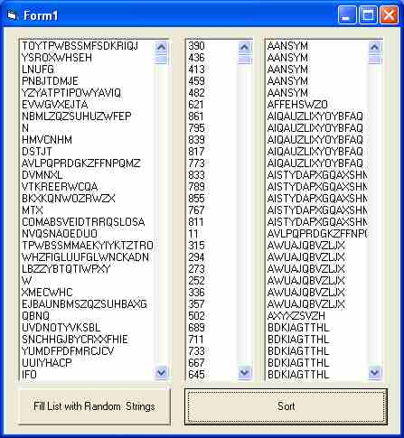

## Sort String Arrays without Swapping Strings

### Description

Sort Array without Swapping Strings

The latest Sort submission by Ulli, whcih is unquestionably superior and advanced is, well, advanced! so i cooked-up this sort which is very simple, the algorithm used is shell sort but instead of swapping strings, we swap their index, and finally return an array of sorted indexes, well sort of (pun intended ;-)
 
### More Info
 
String Array to be Sorted

with the option of Ignoring Case

assumes u have VB6 !!!

Array (of type Long) of Sorted Indexes (indices) that can be used to access the original unchanged array according to the sorted order.

who knows :-p

             |
---                |---
**Submitted On**   |2004-12-24 20:05:02
**By**             |[M\. J\. Highlander](https://github.com/Planet-Source-Code/PSCIndex/blob/master/ByAuthor/m-j-highlander.md)
**Level**          |Intermediate
**User Rating**    |5.0 (15 globes from 3 users)
**Compatibility**  |VB 6\.0
**Category**       |[Miscellaneous](https://github.com/Planet-Source-Code/PSCIndex/blob/master/ByCategory/miscellaneous__1-1.md)
**World**          |[Visual Basic](https://github.com/Planet-Source-Code/PSCIndex/blob/master/ByWorld/visual-basic.md)
**Archive File**   |[Sort\_Strin18330712242004\.zip](https://github.com/Planet-Source-Code/m-j-highlander-sort-string-arrays-without-swapping-strings__1-57898/archive/master.zip)

